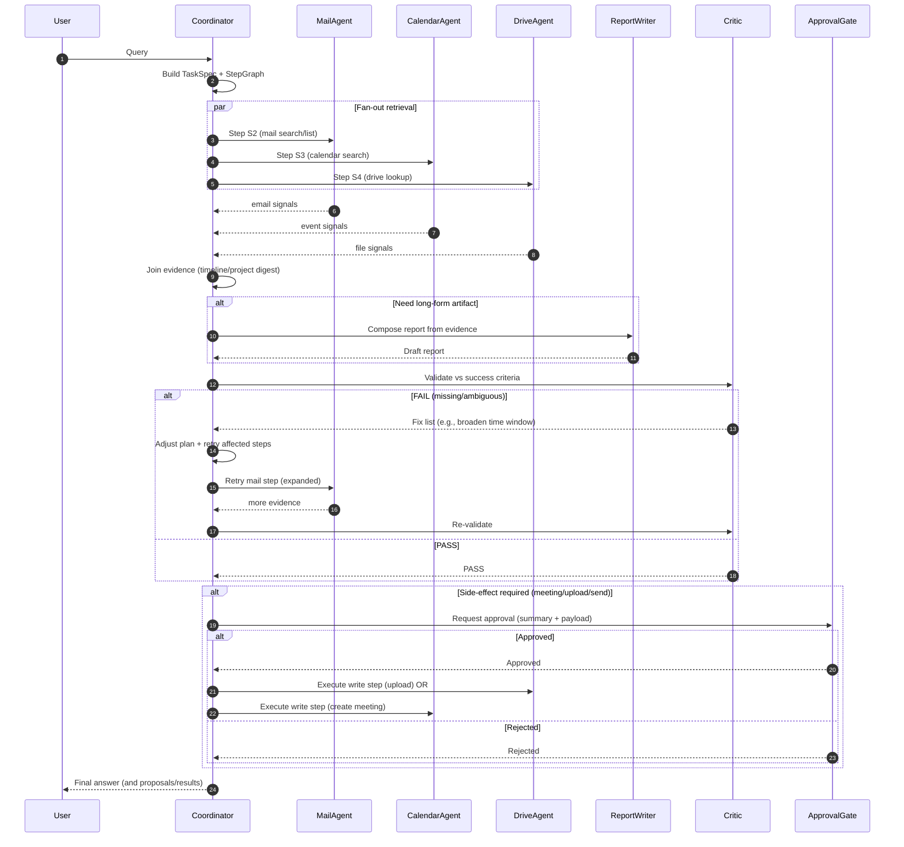

# Google ADK Agent Topology (Scoped to Agent Only)

This document defines a **clear agent topology** for a Google Agent Development Kit (ADK) agent (Python) that answers questions and performs actions across **Email, Calendar, and OneDrive** by invoking your **Microsoft Graph MCP Server**.

Scope: **agent only** (no UI, no auth callback service, no storage layers beyond what the agent needs in-process).

---

## 1) Topology at a glance

### Roles
- **Coordinator (Root)**: Interprets user request, decomposes into a plan, delegates to domain agents, aggregates results, performs recovery/course correction, and produces final response.
- **Domain Specialists**: Mail / Calendar / Drive retrieval + light domain reasoning.
- **Report Composer**: Formats long-form artifacts (status reports) from structured signals.
- **Critic / Validator**: Ensures the response meets quality + safety policies and that actions are correct and minimal.
- **Approval Gate**: A tool-like interface the coordinator calls before side effects (create meeting, upload file, send email).

### Design principles
1. **Dispatcher pattern**: coordinator routes tasks to specialists.
2. **Sequential pipeline**: retrieve → extract → synthesize → validate.
3. **Reflect / course-correct loop**: if results are empty/ambiguous/throttled → broaden query, expand time window, resolve entity, retry.
4. **Human-in-the-loop for side effects**: all writes require explicit approval.
5. **Metadata-first**: avoid retrieving large bodies unless required.

---

## 2) Mermaid topology diagram

```mermaid
flowchart TB
    U[User Query] --> C[WorkspaceCoordinatorAgent
(Dispatcher + Planner + Aggregator)]

    %% Planning + control
    C -->|Parse intent / time window / entities| P[TaskSpec Builder]
    C -->|Creates Plan Steps| PL[Plan Generator]

    %% Domain routing
    C -->|Read tasks| M[MailAnalystAgent]
    C -->|Read tasks| K[CalendarAnalystAgent]
    C -->|Read tasks| D[DriveAnalystAgent]

    %% Shared utilities/tools
    C --> TW[Tool: parse_time_window]
    C --> RP[Tool: resolve_person]
    C --> EX[Tool: extract_action_items]

    %% MCP toolset (single integration surface)
    M -->|MCP tools| MCP[(MCP Toolset
Email/Calendar/OneDrive)]
    K -->|MCP tools| MCP
    D -->|MCP tools| MCP

    %% Synthesis
    M --> S[Evidence Store
(in-memory for this run)]
    K --> S
    D --> S

    %% Writing / formatting
    C -->|Needs long-form doc| R[ReportWriterAgent]
    S --> R

    %% Quality + compliance
    R --> V[CriticAgent]
    C --> V
    V -->|PASS| OUT[Final Answer]
    V -->|FAIL: missing facts/structure| C

    %% Side effects gating
    C -->|Before writes| AG[Approval Gate
(tool call)]
    AG -->|Approved| W[Write Executor
(MCP write tools)]
    W --> MCP
    AG -->|Rejected| OUT
```

---

## 3) Agent objects and responsibilities

### 3.1 WorkspaceCoordinatorAgent (Root)
**Primary responsibilities**
- Build a **TaskSpec** from the user request.
- Generate an explicit **Plan** with steps (read-only first, side-effects last).
- Delegate to domain agents for retrieval/extraction.
- Maintain an **Evidence Store** for the current run.
- Run **recovery and course correction** if data is missing or ambiguous.
- Ask for **approval** before any side effects.
- Aggregate + format final response.

**Inputs**
- User query (string)
- Optional conversation context (recent turns)

**Outputs**
- Natural language answer
- Optional structured payload for UI (e.g., action_items[], meeting_proposal, upload_result)

**Coordinator tools** (local Python tools)
- `parse_time_window(relative_phrase, tz)`
- `resolve_person(name)`
- `extract_action_items(text)`
- `approval_gate(action_summary)`

**Coordinator “control loop”**
1. **Interpret**: intent, entities, time window, constraints.
2. **Plan**: list steps with dependencies.
3. **Execute**: call specialists/tools.
4. **Validate**: Critic checks completion vs success criteria.
5. **Recover** (if needed): adjust parameters and retry.
6. **Commit**: if write needed → approval → execute.


### 3.2 MailAnalystAgent
**Responsibilities**
- Mail retrieval (time windows, project search).
- Optional body fetch for a small set of relevant messages.
- Thread grouping + confirmation of recency.
- Produces structured outputs:
  - `email_summary`
  - `action_items[]`
  - `project_digest`

**Tool access**
- MCP mail tools only.


### 3.3 CalendarAnalystAgent
**Responsibilities**
- Find last meeting with a person, extract agenda/action items.
- Propose meeting options (availability search), not commit without approval.

**Tool access**
- MCP calendar tools only.


### 3.4 DriveAnalystAgent
**Responsibilities**
- Locate folders/files by path or search.
- Identify latest reports, extract blockers.
- Upload report file **only after approval**.

**Tool access**
- MCP drive tools only.


### 3.5 ReportWriterAgent
**Responsibilities**
- Turn evidence into a structured report:
  - Summary
  - Accomplishments
  - Plan
  - Blockers/Risks
  - Asks/Decisions
  - Links to source items

**Notes**
- ReportWriter is *not* a retriever. It only uses the Evidence Store.


### 3.6 CriticAgent (Validator)
**Responsibilities**
- Verify:
  - The question was fully answered.
  - Dates/time windows are explicit.
  - For actions: proposed changes are clearly summarized and approval requested.
  - Data minimization: bodies only used when needed.
- Produces:
  - `PASS` or `FAIL`
  - A short list of required fixes (missing signals, ambiguous entity, insufficient search)


### 3.7 Write Executor (non-LLM helper)
To avoid accidental tool misuse, keep *writes* behind a deterministic helper:
- It receives an **approved action plan** (structured).
- It calls the specific MCP write tools with idempotency keys.

This is not necessarily an ADK agent; it can be a simple function/tool invoked by the coordinator.

---

## 4) Multi-specialist orchestration (fan-out / join)

This section makes it explicit that the coordinator can invoke **more than one specialist** in the same request and how it manages dependencies.

### 4.1 Step graph model (explicit plan steps)
The coordinator builds a plan as a small DAG of steps. Each step is assigned to a specialist (or local tool) and can depend on earlier steps.

**Step schema (recommended)**
```json
{
  "step_id": "S3",
  "name": "Find last meeting with John Johnson",
  "assigned_agent": "CalendarAnalystAgent",
  "inputs": {
    "person": {"name": "John Johnson", "email": null},
    "time_window_hint": "last_180_days"
  },
  "depends_on": ["S1"],
  "outputs": {
    "event_ref": "events[0]",
    "confidence": 0.92
  },
  "retry_policy": {
    "on_empty": "expand_time_window",
    "max_attempts": 3
  }
}
```

**Execution behavior**
- The coordinator may execute independent steps **in parallel** (async fan-out) when safe.
- Steps that depend on prior outputs wait for those dependencies (join).
- All step outputs are merged into the **Evidence Store**.

### 4.2 Fan-out / join strategy
The coordinator uses these patterns:
- **Parallel fan-out** for retrieval when the intent spans multiple domains (mail + calendar + drive).
- **Join + synthesize** after retrieval into a single coherent answer or report.

**When to fan-out automatically**
- The user asks for **agenda/action items**: calendar often has meeting body, mail often has follow-ups.
- The user asks for **status report + upload**: mail+calendar provide signals; drive provides target folder/history.
- The user asks for **latest blockers in a drive folder**: drive retrieves files; mail may confirm recency/owner.

### 4.3 Join rules (how results combine)
The coordinator merges evidence using deterministic keys:
- `email.id`, `event.id`, `file.id`
- Thread keys: `conversationId` / `subject-normalized`
- Entity keys: person email (preferred) then name

It then produces one of the following joined products:
- **Timeline** (meeting → follow-up emails → decisions → action items)
- **Project digest** (latest signals + blockers + owners)
- **Report artifact** (templated status report)

### 4.4 Multi-specialist course correction
If the join is incomplete (e.g., meeting found but no agenda/action items):
- Coordinator calls MailAnalystAgent to look for follow-ups around meeting time.
- If still missing, it expands the calendar window or fetches the event body (if allowed).

---

## 5) Mermaid diagrams

### 5.1 Topology (component wiring)
```mermaid
flowchart TB
    U[User Query] --> C[WorkspaceCoordinatorAgent
(Dispatcher + Planner + Aggregator)]

    %% Planning + control
    C -->|Parse intent / time window / entities| P[TaskSpec Builder]
    C -->|Creates Plan Steps| PL[Plan Generator]

    %% Domain routing
    C -->|Read tasks| M[MailAnalystAgent]
    C -->|Read tasks| K[CalendarAnalystAgent]
    C -->|Read tasks| D[DriveAnalystAgent]

    %% Shared utilities/tools
    C --> TW[Tool: parse_time_window]
    C --> RP[Tool: resolve_person]
    C --> EX[Tool: extract_action_items]

    %% MCP toolset (single integration surface)
    M -->|MCP tools| MCP[(MCP Toolset
Email/Calendar/OneDrive)]
    K -->|MCP tools| MCP
    D -->|MCP tools| MCP

    %% Synthesis
    M --> S[Evidence Store
(in-memory for this run)]
    K --> S
    D --> S

    %% Writing / formatting
    C -->|Needs long-form doc| R[ReportWriterAgent]
    S --> R

    %% Quality + compliance
    R --> V[CriticAgent]
    C --> V
    V -->|PASS| OUT[Final Answer]
    V -->|FAIL: missing facts/structure| C

    %% Side effects gating
    C -->|Before writes| AG[Approval Gate
(tool call)]
    AG -->|Approved| W[Write Executor
(MCP write tools)]
    W --> MCP
    AG -->|Rejected| OUT
```

### 5.2 Runtime sequence (fan-out / join + course correction)


---

## 6) Dataflow and state (within a single run)

### 4.1 TaskSpec
The coordinator builds a TaskSpec used for routing and completion checks.

**Recommended fields**
- `intent`: summarize_emails | find_last_meeting | project_digest | schedule_meeting | create_status_report | inspect_drive_blockers
- `entities`: people[], projects[], folder_paths[]
- `time_window`: start/end
- `constraints`: max_items, metadata_only, include_body_if_needed
- `actions`: proposed side effects (create meeting, upload)
- `success_criteria`: checklist for Critic


### 4.2 Evidence Store (in-memory)
A normalized store for signals collected during execution.

**Example structure**
- `emails[]`: {id, subject, from, received_dt, snippet, body?}
- `events[]`: {id, subject, start_dt, attendees, body?}
- `files[]`: {id, path, name, modified_dt, content_excerpt?}
- `action_items[]`: {text, owner, due?, source_ref}
- `blockers[]`: {text, project, source_ref}


### 4.3 Execution trace (for auditability)
Keep a trace object:
- tool calls made (tool name, params hash, result count)
- recovery actions (expanded time window, broadened query)

This enables deterministic debugging without involving UI components.

---

## 5) Course correction strategy (how topology supports it)

### 5.1 Empty results
If specialists return no results, coordinator tries in order:
1. Expand time window (e.g., 1 day → 7 days → 30 days)
2. Broaden search query (project synonyms, partial names)
3. Resolve person again (try email variants from evidence)
4. Switch retrieval source (calendar → mail, mail → drive)


### 5.2 Ambiguous entity (e.g., “John Johnson”)
Coordinator invokes `resolve_person`:
- Use mail headers + calendar attendees to infer a unique email.
- If still ambiguous, return a short disambiguation prompt **but** also provide partial answer from what was found.


### 5.3 Throttling / transient errors
- Backoff and retry with jitter.
- Reduce scope (smaller time window, fewer fields, fewer bodies).

---

## 6) Side effects (writes) and approvals

### 6.1 What requires approval
- Create/send email
- Create/update calendar event
- Upload/overwrite OneDrive file

### 6.2 Approval Gate contract
The coordinator must call `approval_gate` with:
- Action summary (human-readable)
- Structured payload (machine-readable)

If approved → Write Executor runs; otherwise → return proposal only.

---

## 7) Mapping sample questions to topology

### 7.1 “Summarize the emails I received since yesterday”
1. Coordinator: build TaskSpec(time_window=yesterday→now)
2. MailAnalystAgent: list messages + select top N to fetch body
3. Coordinator: aggregate; Critic validates


### 7.2 “Give me the list of action items assigned”
1. MailAnalystAgent: search for assignment language
2. Tool `extract_action_items`: normalize
3. Critic validates clarity (owner/due/source)


### 7.3 “When was the last time I met with John Johnson…”
1. resolve_person("John Johnson")
2. CalendarAnalystAgent: find latest event with attendee
3. MailAnalystAgent: retrieve follow-ups around that date (optional)
4. Critic ensures agenda + action items extracted


### 7.4 “Check my email on MCP Enablement… summary report + blockers”
1. MailAnalystAgent: project_digest
2. ReportWriterAgent: produce report
3. Critic checks “latest” and blockers present


### 7.5 “Setup meeting with Derek W… research agenda from last meeting”
1. CalendarAnalystAgent: last meeting + notes
2. MailAnalystAgent: follow-ups since last meeting
3. CalendarAnalystAgent: propose times
4. approval_gate → if approved, Write Executor creates meeting


### 7.6 “Create status report on RAG Project and upload to OneDrive”
1. Mail + Calendar + Drive retrieval
2. ReportWriterAgent drafts
3. Critic validates
4. approval_gate → upload via DriveAnalystAgent/Write Executor


### 7.7 “Look at folder ‘status reports’… latest blockers tied to Agentic workflows”
1. DriveAnalystAgent: list children + pick most recent
2. Download content excerpts
3. Extract blockers
4. Critic ensures references to source files

---

## 8) Implementation notes for ADK wiring (agent-only)

### 8.1 Recommended ADK object graph
- One **Root LlmAgent** (Coordinator)
- 3 **LlmAgents** (Mail/Calendar/Drive)
- 1 **LlmAgent** (ReportWriter)
- 1 **LlmAgent** (Critic)
- Local **Function Tools** for deterministic parsing + approvals
- **Shared McpToolset**:
  - Connects to Remote MCP Server via SSE (`MCP_SERVER_URL` + `MCP_AUTH_TOKEN`).
  - Implements **Dynamic Tool Discovery**: automatically fetches tools from the server and wraps them as ADK-compatible callables.
  - Implements **Session Injection**: Automatically injects `session_id` into tool arguments if authenticated.
  - No static tool schema required in code; the agent adapts to the server's capabilities.

- **McpAuthManager**:
  - Handles the interactive **PKCE Authentication** flow acting as a gateway before the Coordinator starts.
  - Manages `begin_pkce` -> User Interaction -> `complete_pkce` handshake.

### 8.2 Tool exposure strategy
- Expose **read tools** to specialists freely.
- Expose **write tools** only to the Write Executor helper (or a restricted agent) to avoid accidental writes.

### 8.3 Prompting strategy (short, deterministic)
- Coordinator prompt emphasizes: plan-first, metadata-first, approvals for writes.
- Specialists prompts: retrieval-only, return structured outputs, no speculative conclusions.
- Critic prompt: return PASS/FAIL + required fix list.

---

## 9) Definition of done (agent scope)
- ✅ Implements the topology above with ADK (using BaseSpecialistAgent wrapper).
- ✅ ReportWriterAgent and CriticAgent implemented.
- ✅ Course correction with expanded time windows and broadened queries.
- ✅ Parallel fan-out execution for independent steps.
- ✅ WriteExecutor for writes (Approval Gate deferred).
- ✅ Local tools wired (parse_time_window, resolve_person, extract_action_items).
- Demonstrates all sample tasks (propose writes; execute writes only after approval).
- Produces structured outputs usable by your existing UI.

